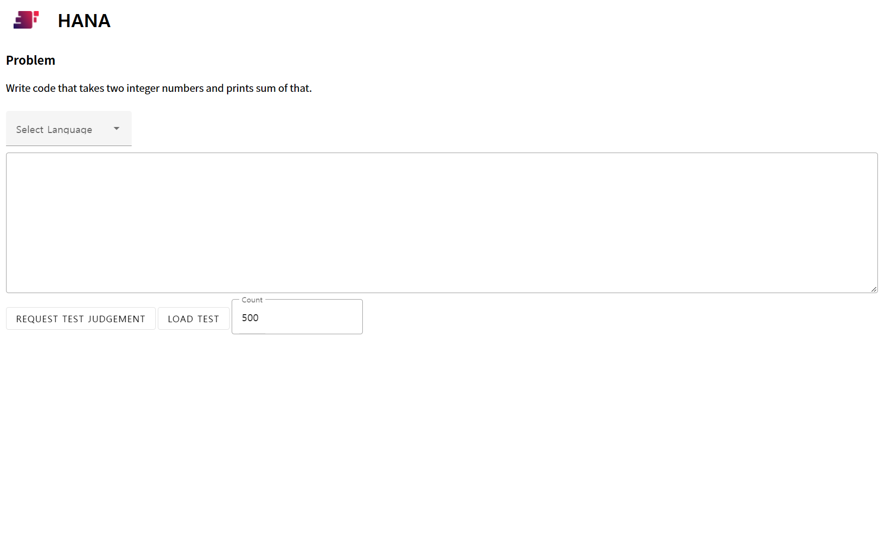

<p align="center"></p>

<h1 align="center">HANA</h1>

[](https://github.com/HancomAC/HANA/actions/workflows/ci.yml)
[](https://github.com/HancomAC/HANA/actions/workflows/codeql.yml)
[](https://hub.docker.com/r/hancomac/hana)

HANA is a PS Judgement Server that runs on Docker.

## Supported Languages

C, C++, Go, Java, Python3, Pypy3, Rust, Text, JavaScript, TypeScript

<details>
<summary>Build option</summary>

-   C

```shell
gcc Main.c -o Main -O2 -Wall -lm --static -std=c99 -DONLINE_JUDGE
```

-   C++

```shell
g++ Main.cpp -o Main -O2 -Wall -lm --static -pipe -std=c++17 -DONLINE_JUDGE
```

-   Go

```shell
go build Main.go
```

-   Java

```shell
javac --release 11 -J-Xms1024m -J-Xmx1920m -J-Xss512m -encoding UTF-8 Main.java
```

-   Python3

```shell
python3 -m compileall -b ${path}
```

-   Pypy3

```shell
pypy3 -m compileall -b ${path}
```

-   Rust

```shell
rustc Main.rs
```

-   TypeScript

```shell
tsc Main.ts
```

</details>

## Installation

```shell
docker run -p 80:80 -it hancomac/hana:lastest
```

## Usage

### Submit

Submit judge request can be done by following request.

You should use `POST` method and `application/json` as content type.

#### API Endpoint

```
/judge
```

#### Body

```typescript
interface Request {
    uid: string
    timeLimit: number
    memoryLimit: number
    language:
        | 'TEXT'
        | 'C'
        | 'CPP'
        | 'JAVA'
        | 'PYTHON3'
        | 'PYPY3'
        | 'RUST'
        | 'JAVASCRIPT'
        | 'TYPESCRIPT'
        | 'GO'
    judgeType:
        | 'CommonJudge'
        | 'OutputOnly'
        | 'Interactive'
        | 'SpecialJudge'
        | 'COMPETITIVE'
    source: {
        name: string
        source: string
    }[]
    dataSet: {
        scoringType: 'PROPORTIONAL' | 'QUANTIZED'
        data: {
            input?: string
            output: string
        }[]
    }[]
    specialJudge?: {
        language:
            | 'TEXT'
            | 'C'
            | 'CPP'
            | 'JAVA'
            | 'PYTHON3'
            | 'PYPY3'
            | 'RUST'
            | 'JAVASCRIPT'
            | 'TYPESCRIPT'
            | 'GO'
        source: string
    }
}
```

##### Example

```json
{
    "language": "CPP",
    "judgeType": "SpecialJudge",
    "specialJudge": {
        "language": "CPP",
        "source": "#include <stdio.h>\n#include <string.h>\n\nFILE * fin;\nFILE * fsol;\nFILE * fuser;\n\nint main(int argc,char *args[])\n{\n\tfin=fopen(args[1],\"r\");\n\tfsol=fopen(args[2],\"r\");\n\tfuser=fopen(args[3],\"r\");\n\n\tint ret=0;\n\tchar a[100], c[100];\n\twhile(fscanf(fsol,\" %[^\\r\\n]s\",a) != EOF){\n  fscanf(fuser,\" %[^\\r\\n]s\",c);\n  if(strcmp(a,c)!=0) {\n  ret=1;\n  break;\n  }\n\t}\n\tfclose(fin);\n\tfclose(fsol);\n\tfclose(fuser);\n\treturn ret; // 0 이면 성공, 1이면 실패\n}\n"
    },
    "source": [
        {
            "name": "Main.cpp",
            "source": "#include <iostream>\nusing namespace std;\nint main(){\n    int a,b;\n    while(cin >> a >> b)\n        cout << a+b << endl;\n return 0;\n}"
        }
    ],
    "dataSet": [
        {
            "scoringType": "QUANTIZED",
            "data": [
                { "input": "1 1", "output": "2" },
                { "input": "10 1", "output": "11" },
                { "input": "5 1", "output": "6" },
                { "input": "1 3", "output": "4" }
            ]
        },
        {
            "scoringType": "QUANTIZED",
            "data": [
                { "input": "15 1", "output": "16" },
                { "input": "17 21", "output": "38" }
            ]
        },
        {
            "scoringType": "QUANTIZED",
            "data": [
                { "input": "1 1", "output": "2" },
                { "input": "10 1", "output": "11" },
                { "input": "5 1", "output": "6" },
                { "input": "1 3", "output": "4" }
            ]
        }
    ],
    "timeLimit": 2000,
    "memoryLimit": 1024
}
```

#### Response

```typescript
interface Response {
    success: boolean
    uid: string
}
```

uid is an unique id for each judge request.

### Getting Response

There are two ways to retrieve result from HANA: Using WebSocket or using HTTP Polling.

#### Using WebSocket

You need to connect to `/` endpoint.

Response will be sent by WebSocket message.

#### Using HTTP Polling

You need to request to `/pull` endpoint with GET method.

Response will be sent by JSON, in `data` field as array.

##### Response Format

```typescript
interface responseOne {
    success: boolean
    type:
        | 'JUDGE_FINISH'
        | 'JUDGE_PROGRESS'
        | 'JUDGE_INFO'
        | 'JUDGE_STATUS'
        | 'JUDGE_ERROR'
    data?: any
    error?: string
}
```

##### Response Type

-   JUDGE_PROGRESS

Message will be sent when judge is progressing.

```typescript
interface responseFinish extends responseOne {
    data: {
        uid: string
        progress: number
        resultCode: 'RUN'
    }
}
```

progress is value between 0 and 1.

-   JUDGE_FINISH

Message will be sent when judge is finished.

```typescript
interface responseFinish extends responseOne {
    data: {
        uid: string
        result: (number | number[])[]
        resultCode: 'AC' | 'WA' | 'TLE' | 'MLE' | 'OLE' | 'RE' | 'CE'
        reason: ('AC' | 'WA' | 'TLE' | 'MLE' | 'OLE' | 'RE' | 'CE')[]
        time: number[]
        memory: number[]
        message: string
    }
}
```

result for each subtask will be sent as array.
element of result will be number if scoringType is QUANTIZED, or number[] if scoringType is PROPORTIONAL.

resultCode is a representing result of each subtask's reason.

message is one sample stderr message when compile error or runtime error.

-   JUDGE_INFO

Message will be sent when user requests to get judge program's info.

-   JUDGE_STATUS

Message will be sent when user requests to get judge status.

-   JUDGE_ERROR

Message will be sent when judge encounters error.

## Test Page



You can test this program by opening `/test` endpoint in your browser.

You can judge 'A+B' problem with sample data.
